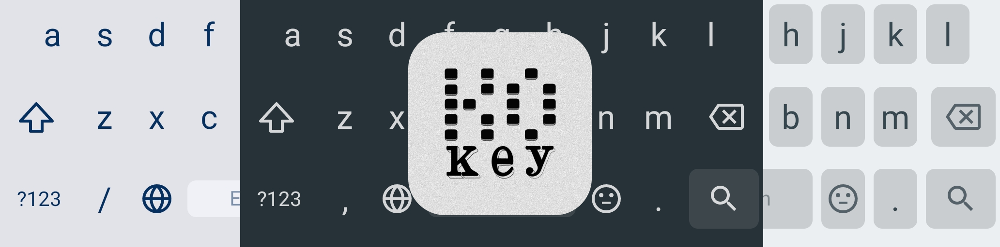

# KoKey 

A keyboard that respects your screen and your attention.

## ⌨ What it does

- Emoji panel with instant search
- Number row
- Swipe the space bar to move your cursor
- Adjustable height for more breathing room
- Custom theme colors

## ⌨ What it doesn't do

- No GIFs
- No spell checker
- No swipe typing
- No ads
- No tracking

## ⌨ Why KoKey

Keyboards used to just be keyboards. Somewhere along the way they became platforms — bloated with suggestions, animations, and features that slowly eat your screen and send your keystrokes somewhere else.

KoKey is a keyboard again. Small, fast, and quiet. It does what you type and nothing more.

## ⌨ Download

## ⌨ Credits

Based on [simple-keyboard](https://github.com/rkkr/simple-keyboard) by rkkr. Licensed under Apache License Version 2.
